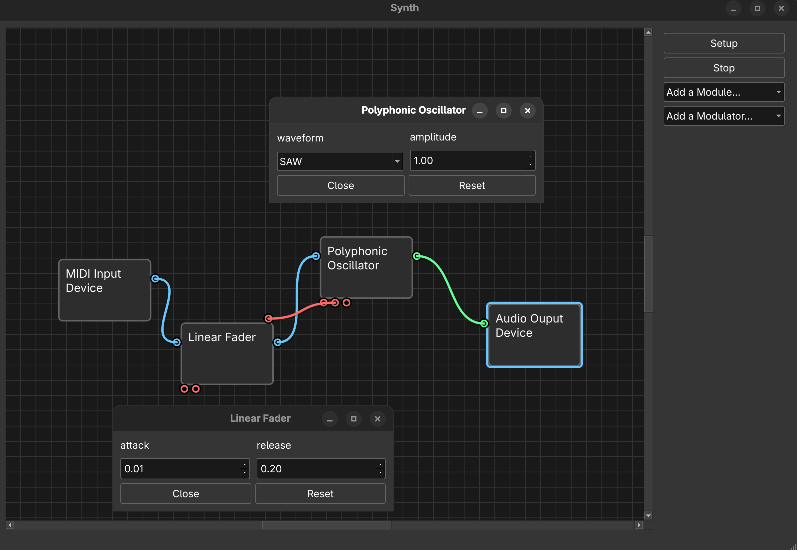

# Syndesium

A fully modular synthesizer application that lets you build any synthesizer you want through a flexible, connection-based architecture.

## License

This project is licensed under the GNU Lesser General Public License v3.0 - 
see the [LICENSE](LICENSE) file for details.

## Third-Party Libraries

This project uses:
- Qt6 (LGPL v3)
- RtMidi (MIT-style)
- RtAudio (MIT-style)

See [THIRD_PARTY_LICENSES.txt](THIRD_PARTY_LICENSES.txt) for complete license information.

## Overview

Syndesium is a standalone modular synthesis environment where you can create, connect, and configure audio modules to design custom synthesizers.



## Features

- **Fully Modular Architecture**: Create and connect individual synthesis modules (oscillators, envelopes, filters, etc.) in any configuration
- **Polyphonic Synthesis**: Built-in support for polyphonic oscillators and voice management
- **Flexible Modulation System**: Every parameter can be modulated by any source through the ParameterMap design
- **Visual Patch Bay**: Draw connections between modules using an intuitive Qt6 interface
- **MIDI Support**: Connect and use any MIDI device for performance control via RtMidi
- **Audio**: Select your desired audio output device with RtAudio support
- **Extensible Design**: Clean separation between frontend and backend enables easy addition of new modules and potential development onto other platforms

## Current Status

**Platform Support**: Linux (currently)

The codebase uses cross-platform libraries (Qt6, RTAudio, RtMidi) and is designed to be extensible to other platforms.

## Prerequisites

### Build Dependencies
- C++20 or later
- Qt6 development libraries
- RtAudio
- RtMidi
- CMake

### Runtime Requirements
- Linux operating system
- Audio system (ALSA, JACK, Pipewire)
- MIDI device (virtual keyboards are supported)

## Installation

```bash
git clone https://github.com/burtonjz/Syndesium.git
cd Syndesium

cmake -S . -B build
cd build
make
```

## Usage

```bash
# run backend executable
./build/synth/synth

# in another terminal, run front end executable
./build/gui/gui
```

1. **Launch Application**: Start Syndesium
2. **Configure Hardware output/input**: Select your audio output device and midi input device through the setup menu.
3. **Create Modules**: Add synthesis modules
4. **Create Modulators**: Add modulation sources
5. **Draw Connections**: Click and drag to connect module outputs to parameter inputs
6. **Play**: Hit play to start the audio loop, and use your MIDI controller or computer keyboard to play your custom synthesizer

## Project Structure

```
Syndesium/
├── gui/          # Qt6 frontend application
├── synth/        # backend synthesis engine
├── shared/       # shared definitions and configurations
```

## Development

### Adding New Components

The modular architecture makes it straightforward to add new components:

1. Create a new module or modulator, inheriting from the base module interface
   - If the module requires MIDI input, inherit from MidiEventListener
   - If the module adjusts MIDI input (like an envelope or sequencer), inherit from MidiEventHandler
2. Update the `synth/src/configs` directory with type traits and default parameters
3. Update the `shared/meta/ComponentRegistry` with the component descriptor
4. Implement your processing logic
5. The detailed gui view will automatically be created based off the descriptor, but you can override specific parameters with something custom by updating `ModuleDetailWidget::createParameter`

## Acknowledgments

Built with:
- [Qt6](https://www.qt.io/) - Cross-platform GUI framework
- [RtAudio](https://github.com/thestk/rtaudio) - Cross-platform audio I/O
- [RtMidi](https://github.com/thestk/rtmidi) - Cross-platform MIDI I/O

---